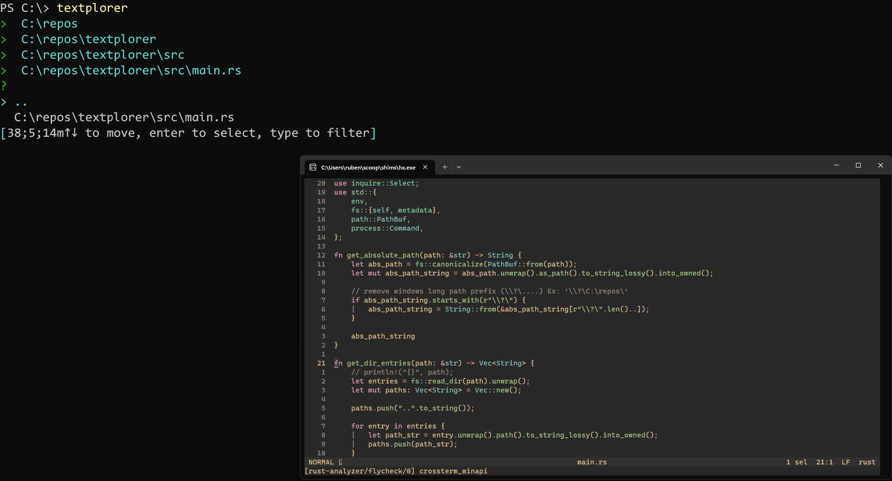

# textplorer
A terminal-based file explorer written in Rust!

If you try to open "enter" a file, you will instead open the file using the [helix editor](https://github.com/helix-editor/helix).
If you don't have helix installed please change the text editor in the source code (because `textplorer` doesn't support command line arguments yet). 

# Usage
1. Run `cargo build`
2. Add the executable to your `PATH`
3. Run it with `textplorer`!
